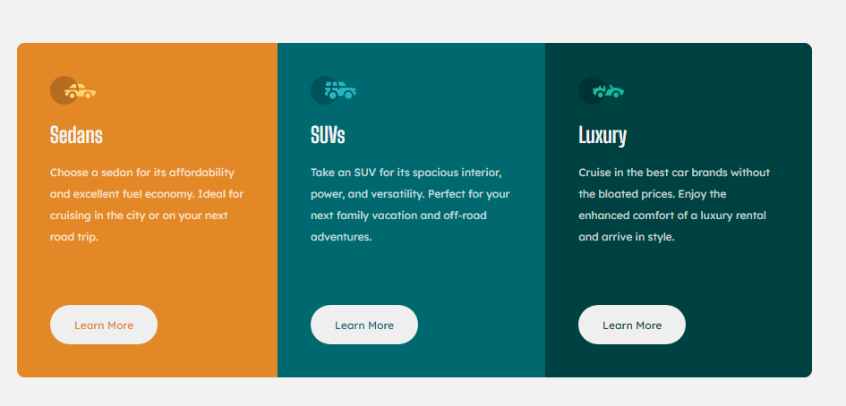

# Frontend Mentor - 3-column preview card component solution

This is a solution to the [3-column preview card component challenge on Frontend Mentor](https://www.frontendmentor.io/challenges/3column-preview-card-component-pH92eAR2-). Frontend Mentor challenges help you improve your coding skills by building realistic projects. 

## Table of contents

  - [Screenshot](#screenshot)
  - [Links](#links)
  - [Built with](#built-with)
  - [Author](#author)
  - [Acknowledgments](#acknowledgments)

## Overview

### Screenshot

### Links

- Solution URL:[solution}(https://github.com/islemtouhami/3-column-preview-card-component-main)
- Live site URL:[live site URL](https://cocky-jang-a73151.netlify.app/)

## My process

### Built with

- Semantic HTML5 markup
- CSS custom properties
- Flexbox

## Author

- Website -islem touhami
- Frontend Mentor - [@islem touhami](https://www.frontendmentor.io/profile/islemtouhami)
